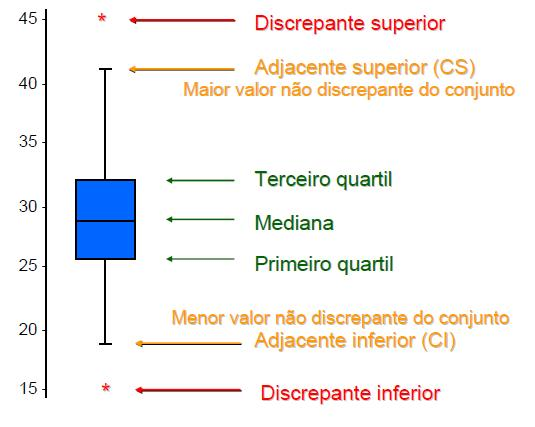

### Primeiro, vamos importar as bibliotecas e configurar o RStudio.
```{r setup}
knitr::opts_chunk$set(echo = TRUE,warning = FALSE,message = FALSE,fig.width = 10, fig.align = "center")

library(readr)
library(dplyr)
library(doBy)
library(ggplot2)
```

### Agora, vamos importar a nossa base de dados!
### Após importar a base de dados, vou escolher 6 séries que servirão para fazer uma análise bem interessante sobre sua avaliação de acordo com o IMDB (...sigla...)

### As séries escolhidas são:

  * How To Get Away With Murder
  * 13 Reasons Why
  * Friends
  * Modern Family
  * Black Mirror
  * Grey's Anatomy
  
```{r, message=FALSE}
series_from_imdb <- read_csv("https://raw.githubusercontent.com/nazareno/imdb-series/master/data/series_from_imdb.csv")
dataSeries<- series_from_imdb %>% filter(series_name %in% c("How to Get Away with Murder", "13 Reasons Why", "Friends","Modern Family", "Black Mirror", "Grey’s Anatomy"))
```

## Qual das séries que eu escolhi é mais bem avaliada no IMDB? A diferença é grande? Pequena?

  * A nossa base de dados fornece inúmeras variáveis que podem ser analisadas a fim de responder essa pergunta. Os dados estão agrupados da seguinte forma: Cada episódio da série tem uma nota, então podemos analisar a média ou mediana das notas dos episódios a fim de saber qual possui a maior nota e, dessa forma, descobrir qual a série mais bem avaliada. Nesse caso utilizaremos a mediana. Por que não utilizar a média? Bem, a média é afetada por notas extremas, que podem distorcer onde a maioria das notas se concentram, de forma que podem alterar a percepção final da pessoa que está lendo os dados. Nós estamos mais interessados na **constância das notas**, de forma que uma nota ou outra que sejam pontos fora da curva podem ser desconsiderados.
  
  * Por exemplo: citar exemplo...

## Agora, ordenando os boxplots pela maior mediana, temos:
### Você não tem ideia do que é um boxplot? Vem cá que eu te ajudo!

...explicar como ler um boxplot...

<center>{widht=30%}

```{r}
ggplot(dataSeries, aes(x=reorder(series_name, -UserRating, FUN=median), y = UserRating)) + geom_boxplot() + ggtitle("\t\t Série mais bem avaliada (de acordo com dados do IMDB)") + xlab("Nome da série") + ylab("Nota dos episódios") + theme(axis.text.x = element_text(angle = 90, hjust = 1))
```

De acordo com o boxplot, podemos ver que a série mais bem avaliada foi How To Get Away With Murder, entre as 6 séries escolhidas. Mas a diferença entre as notas das séries é bem pequena. A mediana de How To Get Away With Murder é 8.7, enquanto 13 Reasons Why possui nota 8.5, junto com Friends. A série com avaliação mais baixa é Modern Family, com mediana 8, uma diferença de 7 décimos para a melhor série.

## Qual das séries que eu escolhi tem episódios de qualidade mais irregular segundo o IMDB? A diferença é grande? Pequena?


### Utilizando o desvio padrão, obtemos o seguinte resultado:

```{r}

ggplot(dataSeries, aes(x=reorder(series_name, UserRating, FUN=sd), y = UserRating)) + geom_boxplot() + ggtitle("\t\t Séries com episódios de qualidade mais irregular (Usando DP)") + xlab("Nome da série") + ylab("Nota dos episódios") + theme(axis.text.x = element_text(angle = 90, hjust = 1))
```

### Utilizando o IQR, obtemos o seguinte resultado:

```{r}
ggplot(dataSeries, aes(x=reorder(series_name, UserRating, FUN=IQR), y = UserRating)) + geom_boxplot() + ggtitle("\t\t Séries com episódios de qualidade mais irregular (Usando IQR)") + xlab("Nome da série") + ylab("Nota dos episódios") + theme(axis.text.x = element_text(angle = 90, hjust = 1))
```

O desvio padrão é uma medida utilizada considerando a média das notas de todos os episódios da série. Quanto maior o desvio padrão, mais distante as notas estão da média, ou seja, mais espalhados os dados estão.

Embora o desvio padrão seja muito utilizado, este ainda é afetado por notas extremas e não foca onde a maioria dos valores estão concentrados. Para uma precisão maior, podemos aliar o uso do desvio padrão ao IQR (Intervalo Inter Quartil), que é uma medida que considera a diferença entre o terceiro e primeiro quartil. Quanto maior a largura do boxplot (a diferença entre os quartis), mais os dados estão espalhados/dispersos. Aliando os dois gráficos acima podemos perceber que as duas séries que variam mais são Black Mirror e 13 Reasons Why, utilizando as duas medidas. Ou seja, as duas apresentam dados irregulares ao considerar a média das notas dos episódios e dentro dos intervalos inter-quartis.


